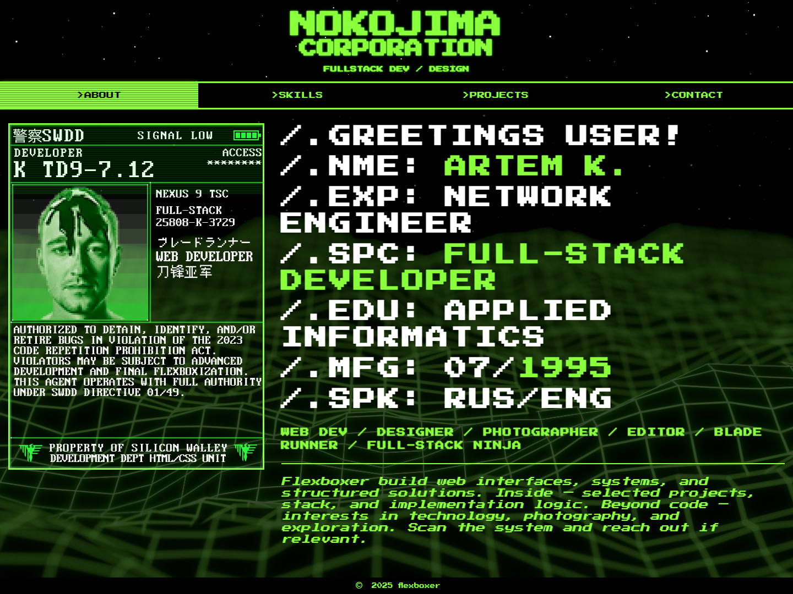
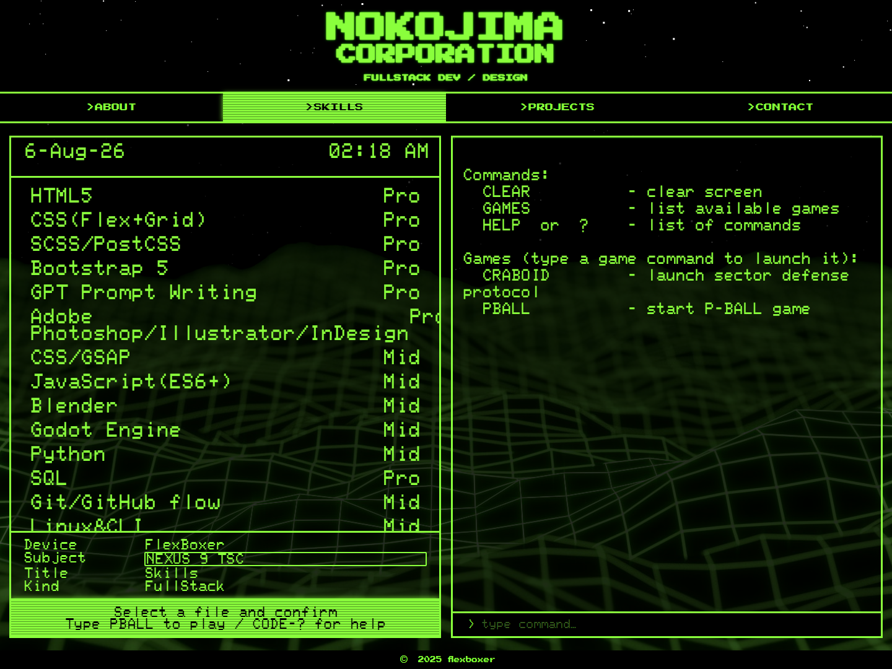
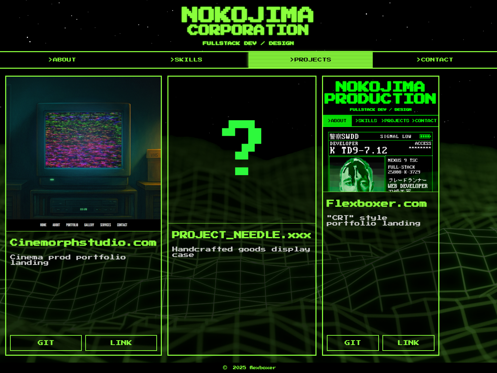
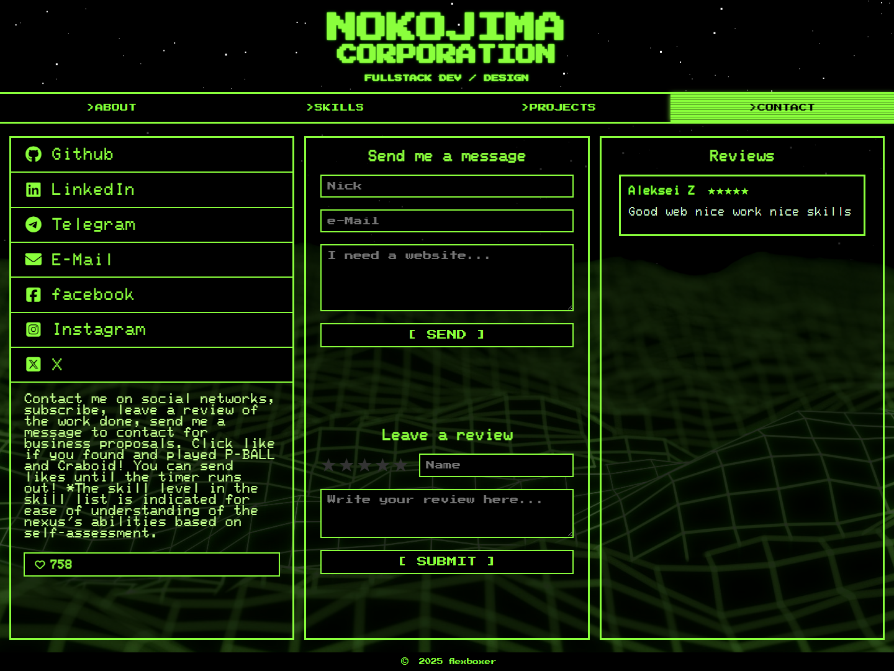

<div align="center">

# FLEXBOXER.COM

### NOKOJIMA CORPORATION — CRT portfolio for a full-stack developer

[](https://flexboxer.com/)
[](#english)
[](#русский)




</div>

---

## English

### About the project

**FLEXBOXER.COM** is a personal portfolio designed as a fictional retro terminal system. The visual language combines CRT scanlines, pixel typography, a star field and a perspective grid with a modular JavaScript interface.

It is not a static mockup: the portfolio includes interactive skills, terminal commands, Canvas games, project data, likes, a moderated reviews flow, protected forms and an administrator dashboard.

### Public experience

| Area | What it does |
| --- | --- |
| **ABOUT** | Introduces the developer inside a CRT/cyberpunk composition with animated Canvas stars. |
| **SKILLS** | Shows a live clock, skill levels and code samples; includes a terminal with `HELP`, `?`, `GAMES`, `CLEAR`, `PBALL` and `CRABOID` commands. |
| **PROJECTS** | Builds project cards from data and supports horizontal scrolling. |
| **CONTACT** | Provides contact and review forms, social links, an approved-review feed and a timed like counter. |

<p align="center">
  
  
</p>

<p align="center">
  
</p>

#### Interface and interaction details

- Responsive four-tab layout: **About**, **Skills**, **Projects**, **Contact**.
- Canvas star field with three parallax-like layers, capped device-pixel ratio, `prefers-reduced-motion` support and animation pause in hidden tabs.
- CRT framing: scanlines, grid overlay, typewriter details, pixel fonts and responsive styling.
- Code-sample browser for skills.
- Two Canvas mini-games: **P-BALL** (Pong-inspired) and **Craboid** (Space Invaders-inspired).
- Project cards rendered from `src/js/data/projects.js` rather than hard-coded markup.
- Like counter backed by Supabase RPC.

### Administration dashboard

The private dashboard lives at `admin.html`. Access is protected with **Supabase Auth**; the entry point is intentionally minimal and is opened from the `©` control in the public footer.

The dashboard lets an authenticated administrator:

- read and delete incoming messages;
- read, approve or delete reviews;
- sign out;
- change the account password.

No administration screenshot is published here: the dashboard can contain private messages and contact details.

### Form security and delivery flow

Public forms do not write to Supabase from the browser. The submission path is:

```text
Browser form
  → Invisible Cloudflare Turnstile
  → /api/contact or /api/review
  → Netlify Function
  → token + action + hostname verification
  → Supabase REST API with a server-only service-role key
```

The implementation also includes:

- a hidden honeypot field;
- server-side type, length and rating validation;
- Netlify rate limiting: **5 requests per 180 seconds** per IP/domain;
- only `approved = true` reviews are visible publicly;
- Supabase RLS with anonymous `insert` policies removed from `messages` and `reviews`.

> Client-side configuration contains public values only. Turnstile secrets and the Supabase service-role key exist solely in Netlify environment variables.

### Project structure

```text
src/
├── index.html                  # public portfolio
├── admin.html                  # protected administrator dashboard
├── css/
│   ├── style.css               # main CRT visual system
│   └── media.css               # responsive rules
├── assets/
│   ├── fonts/
│   └── img/
└── js/
    ├── app.js                  # application bootstrap
    ├── config.js               # public client configuration
    ├── db.js                   # Supabase browser client
    ├── login.js / admin.js
    ├── messages.js / reviews.js / likes.js
    ├── form-status.js
    ├── data/                   # projects and code samples
    ├── ui/                     # tabs, clock, projects, starfield, Turnstile
    ├── terminal/               # terminal commands and input
    └── games/                  # P-BALL, Craboid, game shell and registry

netlify/
├── functions/
│   ├── submit-contact.js
│   └── submit-review.js
└── lib/
    └── form-submission.js      # shared validation, Turnstile and Supabase logic

netlify.toml                    # publishing, API redirects and rate limits
docs/screenshots/                # README screenshots
```

### Local development

```bash
# Interface only
npx serve src

# Full local environment, including Netlify Functions
npx netlify dev
```

Live Server is also suitable for checking the static interface. Protected form delivery requires `netlify dev` or a Netlify deploy because `/api/contact` and `/api/review` are serverless functions.

### Configuration

Public browser configuration is stored in `src/js/config.js`:

```text
SUPABASE_URL
SUPABASE_PUBLISHABLE_KEY
TURNSTILE_INVISIBLE_SITE_KEY
```

The following values belong in Netlify environment variables, with **Functions** scope:

| Variable | Secret | Purpose |
| --- | :---: | --- |
| `TURNSTILE_SECRET_KEY` | Yes | Server-side Turnstile verification |
| `TURNSTILE_ALLOWED_HOSTNAMES` | No | Allowed production and preview hosts |
| `SUPABASE_URL` | No | Supabase project URL for server functions |
| `SUPABASE_SERVICE_ROLE_KEY` | Yes | Server-only Supabase writes |

### Deployment

Netlify publishes `src/` directly. There is no separate bundle step; `netlify.toml` configures the publish directory, functions, API redirects and request limits.

```text
main push → Netlify build → static site + serverless functions → production deploy
```

[Back to top](#flexboxercom)

---

## Русский

### О проекте

**FLEXBOXER.COM** — персональное портфолио, оформленное как вымышленная ретро-система. CRT-развёртка, пиксельная типографика, звёздный Canvas-фон и перспективная сетка объединены с модульным JavaScript-интерфейсом.

Это не статичный макет: внутри есть интерактивный раздел навыков, терминальные команды, Canvas-игры, карточки проектов, лайки, отзывы с модерацией, защищённые формы и административная панель.

### Публичная часть

| Раздел | Возможности |
| --- | --- |
| **ABOUT** | Представляет разработчика в CRT/cyberpunk-композиции с анимированным Canvas-звёздным фоном. |
| **SKILLS** | Показывает часы, уровни навыков и примеры кода; содержит терминал с командами `HELP`, `?`, `GAMES`, `CLEAR`, `PBALL` и `CRABOID`. |
| **PROJECTS** | Генерирует карточки проектов из данных и поддерживает горизонтальную прокрутку. |
| **CONTACT** | Содержит формы сообщения и отзыва, социальные ссылки, ленту одобренных отзывов и счётчик лайков с таймером. |

<p align="center">
  
  
</p>

<p align="center">
  
</p>

#### Детали интерфейса и интерактива

- Адаптивная структура из четырёх вкладок: **About**, **Skills**, **Projects**, **Contact**.
- Canvas-звёздное поле из трёх слоёв с ограничением DPR, поддержкой `prefers-reduced-motion` и остановкой анимации в скрытой вкладке.
- CRT-оформление: scanlines, сетка, typewriter-детали, пиксельные шрифты и адаптивная вёрстка.
- Просмотр примеров кода по навыкам.
- Две Canvas-игры: **P-BALL** (вдохновлена Pong) и **Craboid** (вдохновлена Space Invaders).
- Карточки проектов строятся из `src/js/data/projects.js`, а не дублируются в HTML.
- Счётчик лайков работает через Supabase RPC.

### Административная панель

Приватная админка расположена в `admin.html`. Доступ защищён через **Supabase Auth**; точка входа намеренно незаметна и открывается кнопкой `©` в footer публичного сайта.

После авторизации доступны:

- просмотр и удаление входящих сообщений;
- просмотр, одобрение и удаление отзывов;
- выход из аккаунта;
- смена пароля.

Скриншот админки намеренно не публикуется: там могут находиться личные сообщения и контактные данные.

### Защита форм и путь данных

Публичные формы не записывают данные в Supabase напрямую из браузера. Путь отправки:

```text
Форма в браузере
  → Invisible Cloudflare Turnstile
  → /api/contact или /api/review
  → Netlify Function
  → проверка токена, action и hostname
  → Supabase REST API с server-only service-role key
```

Дополнительно реализованы:

- скрытое honeypot-поле;
- серверная проверка типов, длины данных и рейтинга;
- Netlify rate limit: **5 запросов за 180 секунд** с IP/домена;
- публично выводятся только отзывы с `approved = true`;
- Supabase RLS: анонимные policy для `insert` из `messages` и `reviews` удалены.

> В клиентском коде остаются только публичные значения. Секрет Turnstile и Supabase service-role key хранятся исключительно в переменных окружения Netlify.

### Структура проекта

```text
src/
├── index.html                  # публичное портфолио
├── admin.html                  # защищённая админ-панель
├── css/
│   ├── style.css               # основная CRT-визуальная система
│   └── media.css               # адаптивные правила
├── assets/
│   ├── fonts/
│   └── img/
└── js/
    ├── app.js                  # запуск приложения
    ├── config.js               # публичная конфигурация клиента
    ├── db.js                   # браузерный Supabase-клиент
    ├── login.js / admin.js
    ├── messages.js / reviews.js / likes.js
    ├── form-status.js
    ├── data/                   # проекты и примеры кода
    ├── ui/                     # вкладки, часы, проекты, звёздный фон, Turnstile
    ├── terminal/               # команды и ввод терминала
    └── games/                  # P-BALL, Craboid, оболочка и реестр игр

netlify/
├── functions/
│   ├── submit-contact.js
│   └── submit-review.js
└── lib/
    └── form-submission.js      # общая валидация, Turnstile и запись в Supabase

netlify.toml                    # публикация, API-redirects и rate limit
docs/screenshots/                # скриншоты для README
```

### Локальный запуск

```bash
# Только интерфейс
npx serve src

# Полная среда с Netlify Functions
npx netlify dev
```

Live Server подходит для быстрой проверки интерфейса. Защищённая отправка форм требует `netlify dev` или Netlify deploy, потому что `/api/contact` и `/api/review` — это серверные функции.

### Конфигурация

Публичная конфигурация браузера хранится в `src/js/config.js`:

```text
SUPABASE_URL
SUPABASE_PUBLISHABLE_KEY
TURNSTILE_INVISIBLE_SITE_KEY
```

Следующие значения должны находиться в переменных окружения Netlify с областью **Functions**:

| Переменная | Секрет | Назначение |
| --- | :---: | --- |
| `TURNSTILE_SECRET_KEY` | Да | Серверная проверка Turnstile |
| `TURNSTILE_ALLOWED_HOSTNAMES` | Нет | Разрешённые production- и preview-домены |
| `SUPABASE_URL` | Нет | URL проекта Supabase для серверных функций |
| `SUPABASE_SERVICE_ROLE_KEY` | Да | Серверная запись в Supabase |

### Деплой

Netlify публикует папку `src/` напрямую. Отдельного шага сборки нет: `netlify.toml` задаёт publish directory, функции, API-redirects и ограничения запросов.

```text
push в main → Netlify build → статический сайт + serverless functions → production deploy
```

[Наверх](#flexboxercom)
